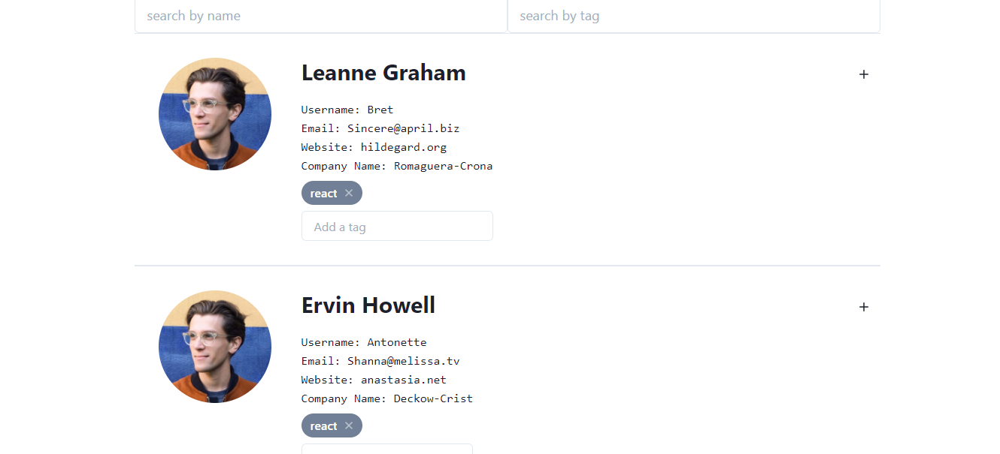

# Users Directory

This App is about pulling user data from an API then store it in the application state management (mobx) and Bootstrap the styling and components using ChakraUI.

# List of users

## About this project

- This Application is built as a front end app consuming an [API](https://jsonplaceholder.typicode.com/users).

## Built With
- ReactJs
- Netlify (For deployment)
- MpbX
- ChakraUI
- ES6 JavaScript

## Live Demo
- For the full working application click [here](https://amazing-neumann-670cc6.netlify.app/)

## Installation
- To get a local copy up and running follow these simple example steps.

### Setup
-  Clone [this](https://github.com/taiwocoker/Users-Directory.git) repo

### Follow:
1. cd into the project directory
2. run npm install
3. run npm start
4. Navigate to localhost:3000

## Author

👤 **Taiwo Coker**

- Github: [@githubhandle](https://github.com/taiwocoker)
- Twitter: [@twitterhandle](https://twitter.com/SelloCoker)
- Linkedin: [linkedin](https://linkedin.com/in/taiwo-coker)

## 🤝 Contributing

- Contributions, issues and feature requests are welcome!

- Feel free to check the [issues page](https://github.com/taiwocoker/Users-Directory/issues)

## Show your support

- Give a ⭐️ if you like this project!

